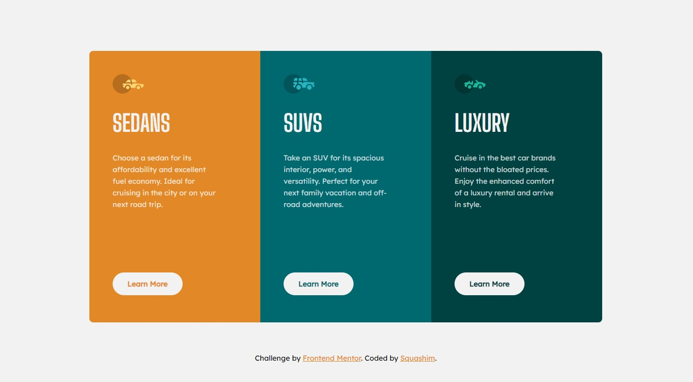

# Frontend Mentor - 3-column preview card component

This is a solution to the [3-column preview card component challenge on Frontend Mentor](https://www.frontendmentor.io/challenges/3column-preview-card-component-pH92eAR2-). Frontend Mentor challenges help you improve your coding skills by building realistic projects. 

## Welcome! 👋

Thanks for checking out this front-end coding challenge.

[Frontend Mentor](https://www.frontendmentor.io) challenges help you improve your coding skills by building realistic projects.

## Table of contents

- [Overview](#overview)
- [The challenge](#the-challenge)
- [Screenshot](#screenshot) 
- [Links](#links)
- [Built with](#built-with)
- [Author](#author)

## Overview

## The challenge

Your users should be able to:

- View the optimal layout depending on their device's screen size
- See hover states for interactive elements

### Screenshot

<table>
        <tr>
            <td>
                
            </td>
            <td>
                
            </td>
        </tr>
</table>

- Solution URL: [https://www.frontendmentor.io/solutions/responsive-3-column-preview-made-with-sass-aMY2hcZTGB](https://www.frontendmentor.io/solutions/responsive-3-column-preview-made-with-sass-aMY2hcZTGB)
- Live Site URL: [https://squashim.github.io/3-column-preview/](https://squashim.github.io/3-column-preview/)

### Built with

- Semantic HTML5 markup
- CSS custom properties
- Flexbox & Grid
- SCSS

## Author

- Website - [@Squashim](https://github.com/Squashim)
- Frontend Mentor - [@Squashim](https://www.frontendmentor.io/profile/Squashim)
